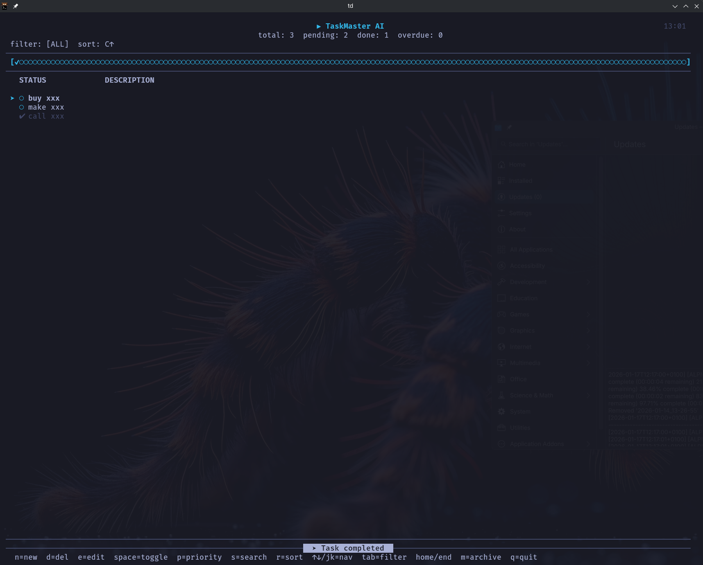

# TaskMaster AI - Professional TUI Task Manager

A full-screen, modern terminal task manager built with Python curses. Features a clean AI Agent-inspired dark interface with keyboard navigation, priority management, real-time search, and deadline tracking.



## Features

### 🎨 Visual Design
- **AI Agent Theme** - Minimalist dark aesthetic with #34baeb accent color
- **Progress Bar** - Visual completion indicator with ✔/○ symbols
- **Status Icons** - ✔ done, ○ pending, priority tags [!]/[!!]
- **Selection Pointer** - ➤ indicator with accent color highlighting
- **Clean Typography** - White text on dark background, dimmed completed tasks

### 📋 Task Management
- Create, edit, delete tasks
- Priority levels: Low (!), Medium (!!), High (!!!)
- Deadline tracking with visual status
- Archive completed tasks (press `M`)

### 🔍 Search & Filter
- **Real-time Search** - Press `s` and type to filter instantly
- Filter by: All, Pending, Done
- Search query displayed in header

### 📊 Sorting & Organization
- Sort by: Created date, Priority, Alphabetical
- Pending tasks always at top, done tasks at bottom
- Home/End key navigation for quick access

### ⌨️ Keyboard Controls

| Key | Action |
|-----|--------|
| `n` | Add new task |
| `e` | Edit task description |
| `d` | Delete task (with confirmation) |
| `Space` | Toggle task status |
| `p` | Change priority |
| `s` | Start real-time search |
| `M` | Archive all done tasks |
| `↑/↓` or `j/k` | Navigate tasks |
| `Home` | Jump to first task |
| `End` | Jump to last task |
| `Tab` | Cycle filters (All → Pending → Done) |
| `r` | Cycle sort (created → priority → alpha) |
| `R` | Toggle sort order |
| `Esc` | Exit search mode |
| `q` | Quit |

## Installation

### Quick Start

```bash
# Run with td alias (add to shell rc)
td

# Or run directly with python
python3 -m taskmaster

# Or make executable
chmod +x taskmaster.py
./taskmaster.py
```

### Global Install

```bash
# Install via pip for global access
pip install --user .

# Then run from anywhere
td
```

### Create Alias

Add to `~/.bashrc` or `~/.zshrc`:

```bash
alias td='python3 /home/milan/opencode_test/agentnovo/taskmaster.py'
```

Then run:

```bash
td
```

## Requirements

- Python 3.7+
- curses library (included with Python on Linux/macOS)
- No external dependencies

## Data Storage

Tasks are saved to `~/.taskmaster_ai.json`:

```json
[
  {
    "id": "uuid",
    "description": "Task description",
    "status": "PENDING|DONE",
    "priority": "LOW|MEDIUM|HIGH",
    "created_at": "ISO timestamp",
    "due_date": "ISO timestamp or null",
    "updated_at": "ISO timestamp"
  }
]
```

## Progress Bar

The header displays a visual progress bar showing task completion:

```
[✔✔✔○○○○] 3/7
[✔✔✔✔✔✔✔] 7/7
```

## Keyboard Shortcuts Reference

```
 n=New | d=Del | e=Edit | p=Priority | Space=Toggle | s=Search | r=Sort | ↑↓/jk=Nav | Tab=Filter | Home/End | M=Archive | q=Quit 
```

## License

MIT
