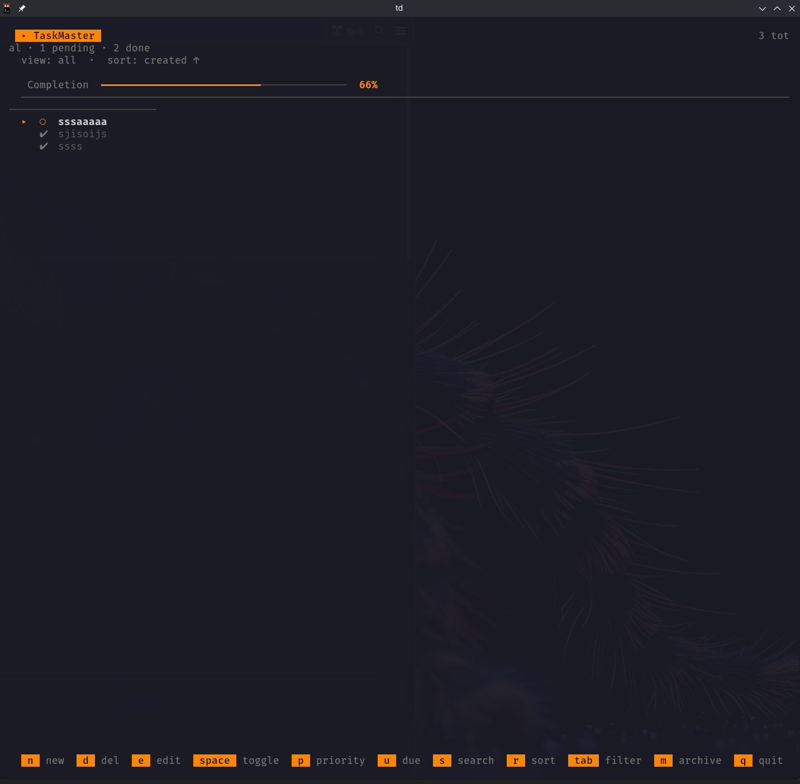

# TaskMaster - Professional TUI Task Manager

A full-screen, modern terminal task manager built with Python curses. Features a clean minimalist dark interface with keyboard navigation, priority management, real-time search, and deadline tracking.



## Features

### 🎨 Visual Design
- **Minimalist Theme** - Minimalist dark aesthetic with #34baeb accent color
- **Progress Bar** - Visual completion indicator with ✔/○ symbols
- **Status Icons** - ✔ done, ○ pending, priority tags [!]/[!!]
- **Selection Pointer** - ➤ indicator with accent color highlighting
- **Clean Typography** - White text on dark background, dimmed completed tasks

### 📋 Task Management
- Create, edit, delete tasks
- Priority levels: Low (!), Medium (!!), High (!!!)
- **Deadline tracking** with visual status (NEW!)
  - Set due dates with `u` key
  - Visual indicators for overdue and due soon tasks
  - Clear due dates by entering 'none'
- Archive completed tasks (press `m` or `M`)

### 🔍 Search & Filter
- **Real-time Search** - Press `s` and type to filter instantly
- Filter by: All, Pending, Done
- Search query displayed in header

### 📊 Sorting & Organization
- Sort by: Created date, Priority, Alphabetical
- Pending tasks always at top, done tasks at bottom
- Home/End key navigation for quick access

### ⌨️ Keyboard Controls

| Key | Action |
|-----|--------|
| `n` | Add new task |
| `e` or `Enter` | Edit task description |
| `d` | Delete task (with confirmation) |
| `Space` | Toggle task status |
| `p` | Change priority |
| `u` | Set/edit due date (NEW!) |
| `s` | Start real-time search |
| `m` or `M` | Archive all done tasks |
| `↑/↓` or `j/k` | Navigate tasks |
| `Home` | Jump to first task |
| `End` | Jump to last task |
| `Tab` | Cycle filters (All → Pending → Done) |
| `r` | Cycle sort (created → priority → alpha) |
| `R` | Toggle sort order |
| `Esc` | Exit search mode |
| `q` | Quit |

## Installation

### Quick Start

```bash
# Run with td alias (add to shell rc)
td

# Or run directly with python
python3 -m taskmaster

# Or make executable
chmod +x taskmaster.py
./taskmaster.py
```

### Global Install

```bash
# Install via pip for global access
pip install --user .

# Then run from anywhere
td
```

### Create Alias

Add to `~/.bashrc` or `~/.zshrc`:

```bash
alias td='python3 /home/milan/opencode_test/agentnovo/taskmaster.py'
```

Then run:

```bash
td
```

## Requirements

- Python 3.7+
- curses library (included with Python on Linux/macOS)
- No external dependencies

## Data Storage

Tasks are saved to `~/.taskmaster.json`:

```json
[
  {
    "id": "uuid",
    "description": "Task description",
    "status": "PENDING|DONE",
    "priority": "LOW|MEDIUM|HIGH",
    "created_at": "ISO timestamp",
    "due_date": "ISO timestamp or null",
    "updated_at": "ISO timestamp"
  }
]
```

## Progress Bar

The header displays a visual progress bar showing task completion:

```
[✔✔✔○○○○] 3/7
[✔✔✔✔✔✔✔] 7/7
```

## Keyboard Shortcuts Reference

```
 n=new  d=del  e=edit  p=priority  u=due  space=toggle  s=search  r=sort  ↑↓/jk=nav  tab=filter  home/end  m=archive  q=quit 
```

## Development

### Running Tests

```bash
# Install development dependencies
pip install -e ".[dev]"

# Run all tests
pytest

# Run with coverage
pytest --cov=taskmaster --cov-report=term-missing
```

### Code Quality

```bash
# Format code with Black
black taskmaster.py models.py constants.py

# Sort imports
isort taskmaster.py models.py constants.py

# Run linting
black --check taskmaster.py models.py constants.py
```

## License

MIT
